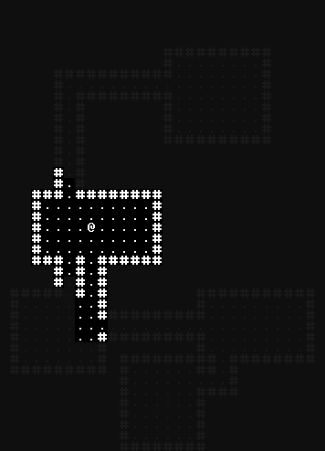

# Display

A tile-based display intended for roguelikes, forked from the display module from [rotLove](https://github.com/paulofmandown/rotLove). Most of this was *not* written by me, I just wanted a standalone display with custom tileset support.

## Usage
Basic usage.
```lua
local Display = require 'display'

function love.load()
   --Create display with size 20 x 20, scale of 1, default foreground of red and background of black
   d = Display:new(20, 20, 1, {1, 0, 0}, {0, 0, 0})
   d:drawText(1, 1, 'Hello')
end

function love.draw()
   d:draw()
end
```

## Screenshot
